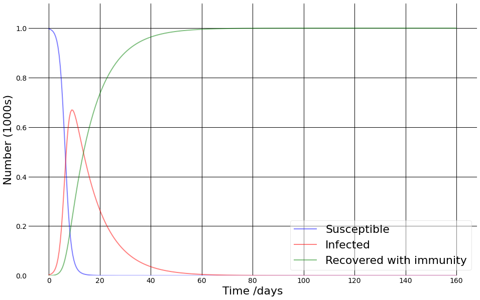
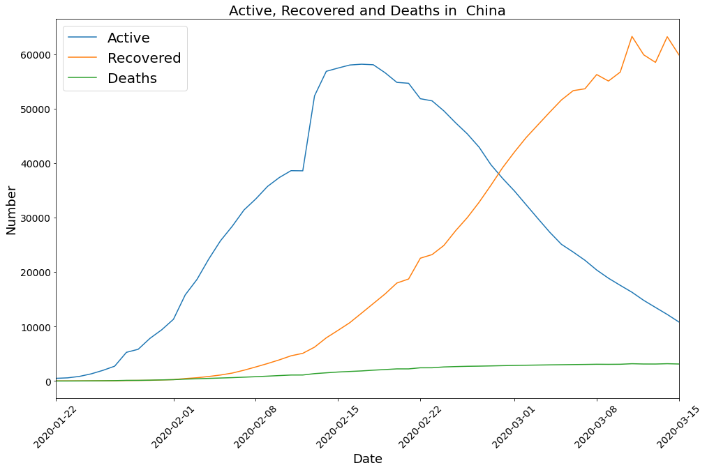

# COVID-2020
This repository is an attempt to analyze and predict Corona Virus cases world wide.

I am no virologist or an expert in Epidemology-- but a simple AI practioner. And so without going into any further details will directly divulge into the data and the insights it offers.

The number of confirmed cases as of today 18th March 2020 have crossed 2 Lakhs i,e: 2,00,000. The image below shows these cases and how they are distributed along the world.

||
|:--:| 
| |
|  **Total number of confirmed cases in every country**|

It's hacky but if you're using GFM or some other MD syntax which supports building tables with pipes you can use the column alignment features:

The graph above makes it clear China had maximum cases, next in line is Italy followed closely by Iran. The picture is indeed appears grim.

We data scientists love 'normalization', it helps us to see things in different scales together. Here also, each country has different population so instead of absolute numbers of confirmed cases, it makes more sense to see the confirmed cases as percentage of each countries population. The graph is below.

||
|:--:| 
| |
|  **Total number of confirmed cases expressed as percentage of each countries population**|

We can see that in this case the total number of cases are less that 0.06% of entire population of a country. The worst effected now being Iceland! yep you read correct. That is a very small number. Indeed many whatsapp and facebook posts going around claiming Corona to be nothing more than a media hype. Trying to convince that more people die of flu and hunger - than Corona will kill. 

## Do not conclude so hastily

From just two graphs let us not make the mistake of concluding. The result maybe reassuring, but is coming from half knowledge, from ignorance and as [Herman Melville](https://g.co/kgs/B8tFps) said 
>> **“Ignorance is the parent of fear.”**

Let us deshelve the ignorance and the resultant fear. That is the rational approach. There are many mathematical models to study infectious diseases. The most used and quite simple is the [SIR](https://web.stanford.edu/~jhj1/teachingdocs/Jones-on-R0.pdf) model. The name arises from the fact that it divides the population into three compartments: 

* **S** Susceptible -- *the ones which can get infection.*  
* **I** Infected -- *the ones infected by the disease and actual carriers.*
* **R** Recovered -- *the individuals who were infected earlier and now fully recovered (and hopefully have developed immunity to the infection).*

Population shifts from Susceptible to Infected to Recovered. I will not bore you with the maths behind it, those interested can refer to the link above and code [here](https://github.com/amita-kapoor/COVID-2020/blob/master/Prediction_Covid_19_WorldWide.ipynb). Just remember the three compartments defined above, and two important parameters:

1. **Contact Rate** - It is a measure of how many persons one infected person can infect-depends on social circle- **more social distancing - less is this number**.
2. **Mean Recovery Rate** - It is the reciprocal of the number of days a person stays contagious. 

When we start the whole population is susceptible, and when we finish the whole population is recovered.  Below is a sample variation of population from susceptible --> infected --> recovered.

||
|:--:| 
| |
|  **Variation of Suscepted, Infected and Recovered with time according to the SIR model**|

>> Remember the model is simple and is not taking death into account. But in real life deaths happen. As we can see from the China data.

Before doing the modeling for other countries, since we know that China reached its peak and then started decline, let us see its graph:

||
|:--:| 
| |
|  **Active, recovered and deaths in China**|

The total population of China is 1404 millions, and total population of wuhan which was the epicenter of this infection is 11 millions.

I see you are calculating only 60000 from 11 million!! You are forgetting from **23rd January 2020** [[Source](https://www.businessinsider.in/slideshows/miscellaneous/chinas-unprecedented-quarantine-of-11-million-people-in-wuhan-is-2-weeks-old-heres-what-it-is-like-in-the-isolated-city-/the-city-of-wuhan-china-was-placed-under-a-lockdown-on-january-23-leaving-around-11-million-people-quarantined-in-the-epicenter-of-the-virus-/slideshow/74012581.cms)] China implemented extensive, stringent quarantine. Something I cannot imagine in my country even in Curfew/Emergency. 

Still the infection spread not necessarily because of new infected-- but because the incubation period of Corona Virus can be from 4-28 days [[Source](https://www.reuters.com/article/us-china-health-incubation/coronavirus-incubation-could-be-as-long-as-27-days-chinese-provincial-government-says-idUSKCN20G06W)]

# Acknowledgements
* The work was inspired by a LinkedIn post from [Antonio Guili](https://www.linkedin.com/in/searchguy/), a good friend and fellow co-author.
* Special thanks to [Marco Visibelli](https://www.linkedin.com/in/marcovisibelli/) for introducing me to [SIR](https://web.stanford.edu/~jhj1/teachingdocs/Jones-on-R0.pdf) model. 
* Thanks to my good friend [Narotam Singh](https://www.linkedin.com/in/narotamsingh/) for the fruitful discussions and suggestions as I was working on it.
