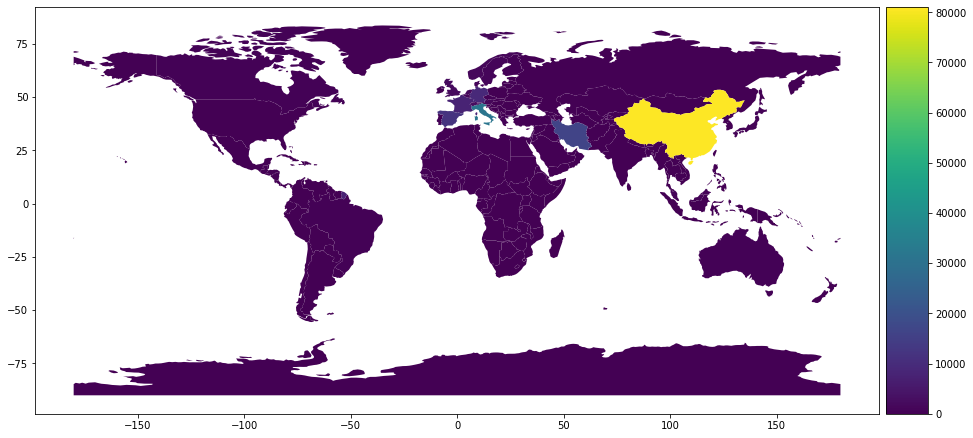
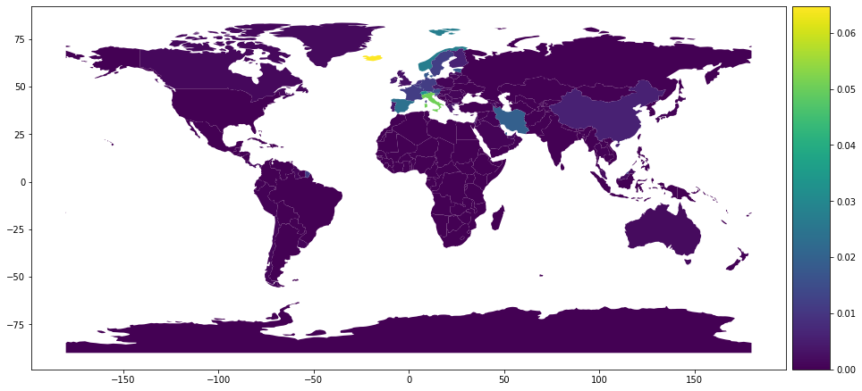

# COVID-2020
This repository is an attempt to analyze and predict Corona Virus cases world wide.

I am no virologist or an expert in Epidemology-- but a simple AI practioner. And so without going into any further details will directly divulge into the data and the insights it offers.

The number of confirmed cases as of today 18th March 2020 have crossed 2 Lakhs i,e: 2,00,000. The image below shows these cases and how they are distributed along the world.

  
  Total number of confirmed cases in every country

The graph above makes it clear China had maximum cases, next in line is Italy followed closely by Iran. The picture is indeed appears grim.

We data scientists love 'normalization', it helps us to see things in different scales together. Here also, each country has different population so instead of absolute numbers of confirmed cases, it makes more sense to see the confirmed cases as percentage of each countries population. The graph is below.

**Total number of confirmed cases expressed as percentage of each countries population**

We can see that in this case the total number of cases are less that 0.06% of entire population of a country. That is a very small number. Indeed many whatsapp and facebook posts going around claiming Corona to be nothing more than a media hype. Trying to convince that more people die of flu and hunger - than Corona will kill. 

## Do not conclude so hastily

From just two graphs let us not make the mistake of concluding. The result maybe reassuring, but is coming from half knowledge, from ignorance and as [Herman Melville](https://g.co/kgs/B8tFps) said 
>> **“Ignorance is the parent of fear.”**

Let us deshelve the ignorance and the resultant fear.

We all need ressurances, and when confronted with a grim/fearful situation. Majority responds with flight.  

# Acknowledgements
* The work was inspired by a LinkedIn post from [Antonio Guili](https://www.linkedin.com/in/searchguy/), a good friend and fellow co-author.
* Special thanks to [Marco Visibelli](https://www.linkedin.com/in/marcovisibelli/) for introducing me to [SIR](https://web.stanford.edu/~jhj1/teachingdocs/Jones-on-R0.pdf) model. 
* Thanks to my good friend [Narotam Singh](https://www.linkedin.com/in/narotamsingh/) for the fruitful discussions and suggestions as I was working on it.
